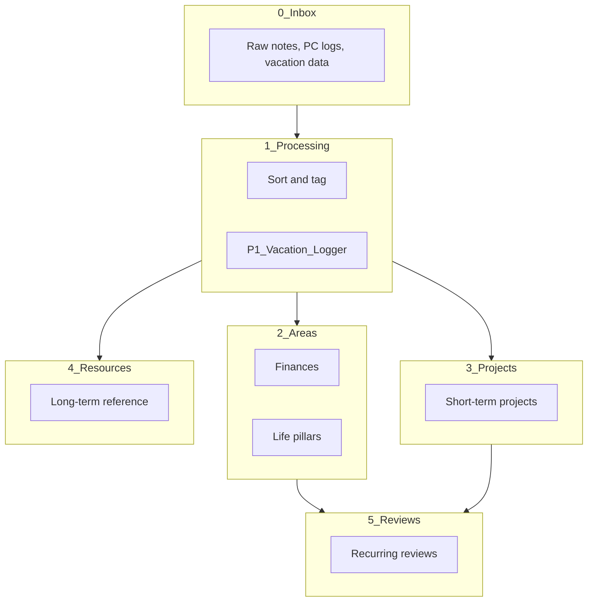
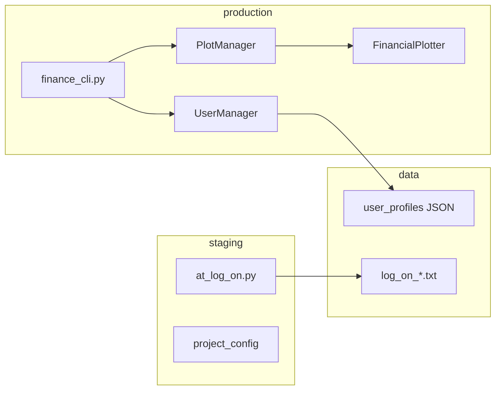

# Project Overview and Improvement Plan

## How Your Project Works

You have **two related but separate projects** in your workspace:

### 1. MIKZAGI (mikzagi)

**Purpose:** A personal life management system—"an idea factory" with the principle "Aid in living. Memories in death."

**Architecture:**

**Key components:**

| Component | Location | Status |
|-----------|----------|--------|
| **Folder system** | `0_Inbox` → `5_Reviews` | Active; documented in [README.md](README.md) |
| **Finance loader** | [mikzagi/fin/outputs/loader.py](mikzagi/fin/outputs/loader.py) | Working; loads `now.csv` |
| **Finance inputs** | [mikzagi/fin/inputs/now.csv](mikzagi/fin/inputs/now.csv) | 3 accounts (chequing, saving) |
| **Main entry** | [mikzagi/main.py](mikzagi/main.py) | Stub only; prints "Hello from mikzagi!" |
| **Reviews** | `5_Reviews/R_*` | Active; structured markdown with ratings, goals, wins |

**Data flow (finance):**

- `now.csv` → `load_accounts()` → normalized dict keyed by `account_id`
- Loader expects `account_id`, `account_type`, `currency`, `balance`
- CSV has `account_owner` but loader looks for `owner` → mismatch (owner always `None`)

**Design docs:** [fin/README.md](mikzagi/fin/README.md) describes a full finance engine (wizard UI, monthly ledger, scenarios). Only the loader is implemented.

---

### 2. Pappa (pappa)

**Purpose:** Production tools for personal data—finance CLI, user management, logging, plotting.

**Architecture:**

**Key components:**

| Component | Purpose |
|-----------|---------|
| **finance_cli.py** | Register, login, profile, password reset; interactive dashboard with charts |
| **UserManager** | Auth, profiles, demo users; stores in `production/finance/data/` |
| **PlotManager / FinancialPlotter** | Income vs expenses, expense breakdown, goals, cash flow (matplotlib) |
| **at_log_on** | PyQt6 app; user enters text at log-on; saves to `data/KZ_ADMIN/kz_pc_at_log_on/` |
| **log_on files** | Timestamped journal entries (e.g. `log_on_2026_02_21_22_54_26.txt`) |

**Relationship to MIKZAGI:** No code integration. P1_Vacation_Logger README notes: *"Need to write some interfacing script between mikzagi and personal data access."* MIKZAGI is the planning/review layer; pappa is the operational layer.

---

## Improvement Recommendations

### High impact (do first)

1. **Fix loader–CSV column mismatch**
   - [loader.py](mikzagi/fin/outputs/loader.py) uses `row.get("owner", None)` but [now.csv](mikzagi/fin/inputs/now.csv) has `account_owner`
   - Change to `row.get("account_owner", row.get("owner", None))` or standardize CSV to `owner`

2. **Wire main.py to fin**
   - [main.py](mikzagi/main.py) does not use fin at all
   - Add a simple CLI or subcommand to load and display accounts (e.g. `python -m mikzagi fin status`)

3. **Create the MIKZAGI–pappa bridge**
   - Implement the interfacing script mentioned in [P1_Vacation_Logger](1_Processing/P1_Vacation_Logger/README.md)
   - Options: (a) MIKZAGI imports pappa's UserManager/profile data for finance views; (b) pappa writes summaries to MIKZAGI's `2_Areas` or `0_Inbox`; (c) shared config so both use the same data paths

### Medium impact

4. **Move loader out of `outputs`**
   - `fin/outputs/loader.py` is an input loader, not an output
   - Move to `fin/loaders.py` or `fin/inputs/loader.py` for clearer structure

5. **Add requirements.txt**
   - pyproject.toml exists but no `requirements.txt`
   - Add one for simpler installs and CI

6. **Complete the User Manual**
   - README says "User Manual: TBD"
   - Add a short workflow: Inbox → Processing → Areas/Projects → Reviews, plus how to run finance loader

7. **Standardize paths in finance_cli**
   - Uses relative paths like `../data`, `../../plots`; fragile when run from different dirs
   - Use `Path(__file__).resolve().parent` or `project_config` for paths

### Lower priority

8. **Resume fin engine roadmap**
   - From [fin/README.md](mikzagi/fin/README.md): next step is `income_streams.csv` + `load_income_streams()`

9. **Review template consistency**
   - `R_17_01_2026` uses "Purpose", "Goals", "Results", "Monthly Review"; `TEMPLATE` may differ
   - Align templates so reviews are comparable

10. **Add .gitignore for lock files**
    - `fin/inputs/.~lock.now.csv#` and `.~lock.now.ods#` are in git status; add to `.gitignore`

---

## Summary

| Project | Role | Current state |
|---------|------|---------------|
| **MIKZAGI** | Planning, reviews, life areas | Folder system active; finance loader works but main.py unused; no engine yet |
| **pappa** | Finance CLI, logs, dashboards | Operational; finance CLI, user profiles, plotting; no link to MIKZAGI |

**Next logical step:** Fix the loader column mapping, wire `main.py` to fin, then add a small bridge script so MIKZAGI can read pappa's finance data for reviews and dashboards.
